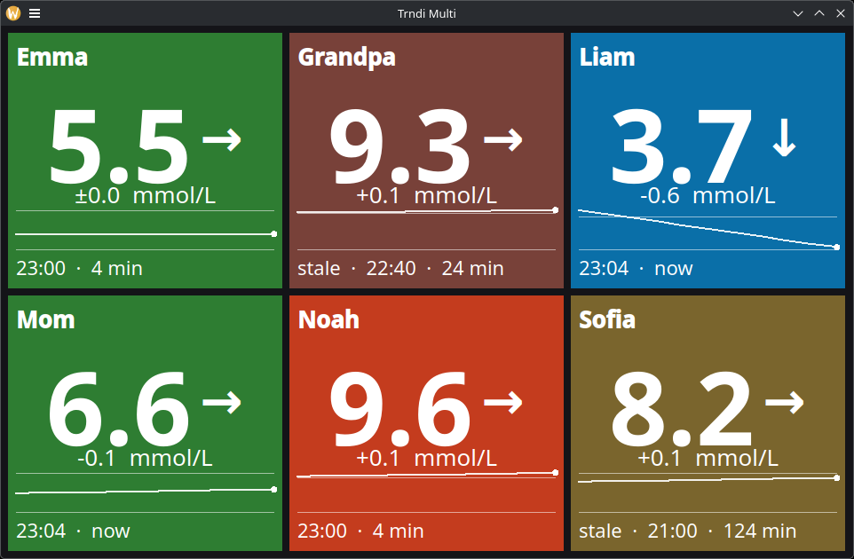

[](https://github.com/slicke/trndi-multi/actions/workflows/build.yml) [](LICENSE)

# trndi-multi - every Trndi account in one window

## A wall display for households and caregivers who follow more than one person

trndi-multi is a companion to the [Trndi](https://github.com/slicke/trndi) desktop app. Trndi's multi-user mode lets one machine hold several accounts, but shows one at a time. trndi-multi puts them all on the screen at once: one tile per account, coloured by range, with the value, trend arrow, delta and a sparkline of the last three hours.



It is built on the very same API and settings layer as Trndi (vendored as a submodule), so it supports the same backends - _Nightscout - Dexcom - FreeStyle Libre - Tandem Source - CareLink - xDrip_ - and needs **no configuration of its own**.

## How it works

- **Accounts come from Trndi.** Set them up in Trndi's settings window (the "Multi User" tab, see [Trndi's multi-user guide](https://github.com/slicke/trndi/blob/main/guides/Multiuser.md)). trndi-multi reads the same settings store and shows every account that has a backend configured, the default account first. Nicknames carry over as the tile titles. There is nothing to configure here; to add, rename or remove an account, use Trndi.
- **One unit for the wall.** Accounts can use mmol/L and mg/dL side by side in Trndi. Here everything is shown in the first account's unit, so the wall reads as one thing.
- **Each account polls on its own.** Every account is fetched on its own thread, one request per reporting interval, timed to land just after the next reading is due. A slow login on one account never holds up the others.
- **Colours mean the same as in Trndi.** Green in range, red-orange above the high limit, red below the low one; where the account has a personal target band inside those limits, amber and blue for the room between. The thresholds are the account's own, applied exactly as Trndi applies them.
- **Old readings look old.** A reading the backend could only serve as a fallback, or one that has aged past two reporting intervals, dims the tile and marks the footer `stale`. The footer always shows the reading's time and age.
- **No data says why.** An account that cannot connect shows the backend's error on its tile; the others carry on.

## Keys

| Key | Action |
|-----|--------|
| `F5` | Refetch every account now |
| `F11` | Toggle full screen |
| `Esc` | Leave full screen |
| `Q` | Quit |

The grid refills the window on resize and picks the column count that gives the biggest tiles, so two accounts sit side by side in a wide window and one above the other in a tall one.

## Downloads

Every push to `main` that builds green on all platforms becomes a rolling `build-N` release on the [releases page](https://github.com/slicke/trndi-multi/releases), with:

| Asset | Notes |
|-------|-------|
| `trndi-multi-linux-amd64`, `trndi-multi-linux-arm64` | Needs the Qt6 LCL bindings (`libqt6pas6` on Debian/Ubuntu, `qt6pas` on Fedora) and libcurl installed. `chmod +x` and run. |
| `trndi-multi-windows-x64.zip` | The exe with `libcurl.dll` beside it. Unzip and run. |
| `trndi-multi-macos-arm64.zip` | An unsigned `.app` for Apple Silicon; right-click, Open the first time. |

## Building

Needs Lazarus (lazbuild) with the LCL, and libcurl (the HTTP transport, as in trndi-cli). Clone with the submodule:

```
git clone --recurse-submodules https://github.com/slicke/trndi-multi.git
cd trndi-multi
make            # release build to bin/trndi-multi (Qt6 on Linux)
make debug      # debug build; also compiles in Trndi's debug backends
make install    # to /usr/local/bin
```

`make WIDGETSET=gtk2` (or any widgetset your Lazarus has) picks another LCL backend; the Makefile defaults to qt6 on Linux and BSD, cocoa on macOS. Windows builds with `.\make.ps1` (win32 widgetset) and needs `libcurl.dll` next to the exe.

The debug build knows Trndi's synthetic `API_D_*` backends, which is how the screenshot above was made: a scratch `Trndi.cfg` under `XDG_CONFIG_HOME` with six accounts pointed at them.

## Not (yet) here

Deliberately out of scope for now: editing accounts (Trndi does that), per-account language and unit, alarms and sounds, JavaScript extensions and the Web API. Trndi itself has all of those.

## Disclaimer

trndi-multi is not a medical device. The data it shows may be delayed, inaccurate or unavailable - do not make medical decisions based on it, and verify with your official devices. See [Trndi's disclaimer](https://github.com/slicke/trndi/blob/main/DISCLAIMER.md), which applies here in full.

## License

GPLv3, like Trndi. See [LICENSE](LICENSE).
