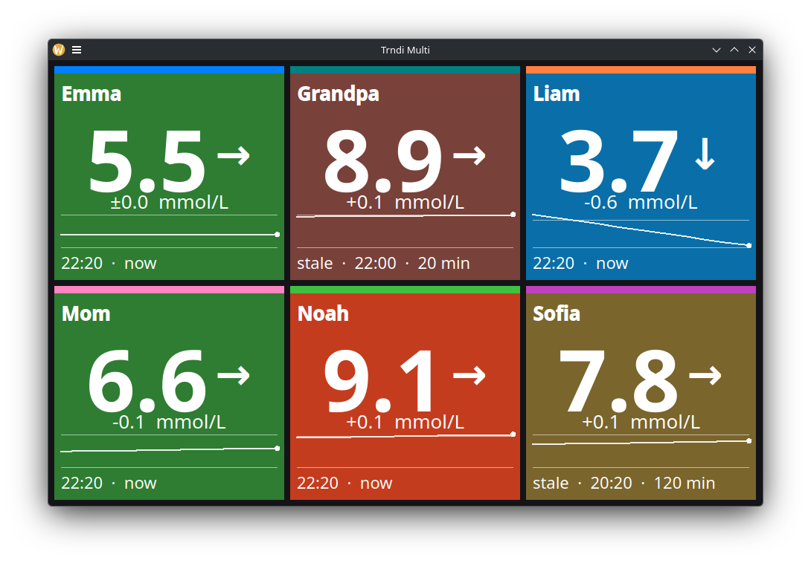

[](https://github.com/slicke/trndi-multi/actions/workflows/build.yml) [](LICENSE)


# trndi-multi - every Trndi account in one window

## A wall display for households and caregivers who follow more than one person

trndi-multi is a companion to the [Trndi](https://github.com/slicke/trndi) desktop app. Trndi's multi-user mode lets one machine hold several accounts, but shows one at a time. trndi-multi puts them all on the screen at once: one tile per account, coloured by range, with the value, trend arrow, delta and a sparkline of the last three hours.



It is built on the very same API and settings layer as Trndi (vendored as a submodule), so it supports the same backends - _Nightscout - Dexcom - FreeStyle Libre - Tandem Source - CareLink - xDrip_ - and shares Trndi's accounts: **a Trndi already set up needs no configuration at all**, and accounts added here are Trndi accounts too.

## Setting up accounts

Accounts live in Trndi's settings store, and each one needs a backend before it gets a tile. Set them up in whichever program is handier:

**In trndi-multi:** right-click the window and choose _Accounts_. Every account is a tab with the few things a tile needs: a nickname (the tile title), the system (Nightscout, Dexcom, and so on), its user and password, and the unit. The _+_ tab adds an account; it asks for the account name once, and that name cannot be changed afterwards (it is the key everything else is stored under, and Trndi cannot rename it either). _Remove account_ takes an account off the wall and, if you say so, erases its settings; kept settings come back when an account with the same name is added again. Nothing is written until _Save_, after which the tiles reload. CareLink is the exception: it takes token data captured by a browser login rather than a password, and only Trndi has the helper that runs that login (see Trndi's CareLink guide). Set a CareLink account up in Trndi and it appears here.

**In Trndi:** the full walkthrough is in [Trndi's multi-user guide](https://github.com/slicke/trndi/blob/main/guides/Multiuser.md); the short version:

1. **Start Trndi** and open its settings (right-click the window).
2. **Add the accounts.** On the _Accounts_ page (under _App & system_ in the sidebar) click _+ Add_ and enter a name for each person. Give them a nickname and colour if you like: the nickname becomes the tile title. Close the window and save.
3. **Restart Trndi.** Now that more than one account exists, it asks which one to use at start-up. Pick one of the new accounts.
4. **Configure that account's backend** in settings (Nightscout, Dexcom, and so on), as you would for a single-user Trndi. Save and close.
5. **Repeat steps 3 and 4** for every account. Each account has its own backend, thresholds and unit; an account without a backend is skipped by trndi-multi.
6. **Start trndi-multi.** It reads the same settings store and shows one tile per configured account, the default account first.

Changes made in Trndi show up in trndi-multi at its next start. Both programs rewrite the account list when they save, so do not have both settings windows open at once: whichever saves last wins.

## First run

The first start puts up the medical disclaimer, the same one Trndi shows, and waits for it to be accepted before any reading is drawn. Acceptance is stored once per install as `trndi-multi.<date>` in Trndi's settings store, at the root rather than under an account: the person at a wall display is usually not the person whose account is on it, so an account's own acceptance in Trndi (`license.<date>`) does not stand in for it. The date is bumped when the terms change materially, and a returning user is then asked to accept the updated terms once more. For a kiosk, run the program once normally before enabling `--kiosk`, or the first start waits for a click that nobody is there to give.

## How it works

- **One unit for the wall.** Accounts can use mmol/L and mg/dL side by side in Trndi. Here everything is shown in the first account's unit, so the wall reads as one thing.
- **Each account polls on its own.** Every account is fetched on its own thread, one request per reporting interval, timed to land just after the next reading is due. A slow login on one account never holds up the others.
- **Colours mean the same as in Trndi.** Green in range, red-orange above the high limit, red below the low one; where the account has a personal target band inside those limits, amber and blue for the room between. The thresholds are the account's own, applied exactly as Trndi applies them. The sparkline carries them too: the room between the limits is washed a shade lighter, the personal target band lighter still, and the limits are hairlines, so a line that leaves the wash has left the range. The line and its end dot are drawn through Trndi's antialiased rasterizer, in device pixels on a scaled desktop.
- **Old readings look old.** A reading the backend could only serve as a fallback, or one that has aged past two reporting intervals, is stale: the tile fades from its range colour towards slate the older the reading gets, the value and arrow are greyed as the last known rather than the current, and the delta line becomes _No data for 23 min_. That line turns amber after 30 minutes and red after 60, the same steps as Trndi's own status card, so a sensor that has dropped off overnight stands out from one that missed an upload. The footer always shows the reading's time and age.
- **Rotated tokens are saved.** CareLink swaps its refresh token on every refresh and revokes the old one. trndi-multi writes the new one back to the account's settings the same way Trndi does, so neither program is left with a dead token at its next start. Two consequences: let only one of the two programs poll a given CareLink account at a time (each refresh revokes the token the other still holds, so they log each other out; a separate care partner login per program avoids this), and when the token has expired anyway, typically after a night with neither program running, log in again in Trndi. The tile says so and recovers on its next fetch.
- **No data says why.** An account that cannot connect shows the backend's error on its tile; the others carry on.

## Reports

_Save report_ in the menu writes a PDF with one section per account: the latest reading as the tile shows it, the last 24 hours' time in range (by the account's own limits and, where set, its personal target band), mean, spread and extremes, a chart of the day's readings against those limits, and an hourly table. Something to hand to a clinic, and the one thing a wall cannot show.

The day's readings are fetched through each account's existing connection (a second login would revoke a CareLink token), so the wall pauses its own polling for the few seconds the report takes and resumes when it is saved. Dexcom Share serves at most a day, which is why the report covers a day; time in range is the share of readings, not of time, so a gap in the data is not counted either way. Every page carries the medical disclaimer.

The dialogs and the report are rendered by [Pixie](https://gitlab.com/retrofoxed/pixie), a pure-Pascal HTML/CSS engine vendored as a submodule (`vendor/pixie`, MIT). It draws through the same widgetset as the rest of the window and adds no runtime dependency.

## Keys and flags

| Key | Action |
|-----|--------|
| `F5` | Refetch every account now |
| `F11` | Toggle full screen |
| `Esc` | Leave full screen (not in kiosk mode) |
| `Q` | Quit |
| Click a tile | The account up close: the reading, its limits and personal target band, how and when it is polled, the backend's full error text, and the last three hours' readings as a table. Kept up to date while open. Not in kiosk mode. |
| Right-click | Menu: _Accounts_, refresh, full screen, _Always on top_, _Save report_, _Check for updates_, _About_, quit. Not in kiosk mode, where a wall display's passwords should not be one click away. |

| Flag | Effect |
|------|--------|
| `--fullscreen` | Start full screen |
| `--kiosk` | For a dedicated wall display: full screen, pointer hidden, Escape ignored, and the machine and screen kept awake for as long as it runs. On Linux that holds a logind idle/sleep lock, the desktop session's own idle inhibition over D-Bus (GNOME, KDE and anything with a desktop portal) and turns off X11 blanking; macOS uses `caffeinate`, Windows `SetThreadExecutionState`. All best-effort, and released on exit. |

On macOS pass flags through the bundle: `open -a trndi-multi --args --kiosk`.

_Always on top_ keeps the window above other programs' windows, for a wall that is also a desk: a small window in a corner that nothing covers. It is remembered between starts, at the root of Trndi's settings store, and yields to full screen, which is above everything anyway. Wayland has no way for a program to ask for this, so on a Wayland desktop the program runs through XWayland while the setting is on (GNOME and KDE both keep an XWayland window with that state on top); switching it on there offers a restart, since the toolkit can only be chosen at start. A `QT_QPA_PLATFORM` set in the environment is respected either way.

Full screen, however it was entered, adds a clock strip above the tiles with the time and date: a wall display has no panel or taskbar to show them. It goes away with full screen.

The grid refills the window on resize and picks the column count that gives the biggest tiles, so two accounts sit side by side in a wide window and one above the other in a tall one.

## Downloads

Every push to `main` that builds green on all platforms becomes a rolling `build-N` release on the [releases page](https://github.com/slicke/trndi-multi/releases), with:

| Asset | Notes |
|-------|-------|
| `trndi-multi-linux-amd64`, `trndi-multi-linux-arm64` | Needs the Qt6 LCL bindings (`libqt6pas6` on Debian/Ubuntu, `qt6pas` on Fedora) and libcurl installed. `chmod +x` and run. |
| `trndi-multi-windows-x64.zip` | The exe, self-contained (WinHTTP for transport, the registry for settings). Unzip and run. |
| `trndi-multi-macos-arm64.dmg` | Unsigned `Trndi Multi.app` for Apple Silicon: open the image, drag it to Applications, then clear the quarantine flag once in Terminal with `xattr -c "/Applications/Trndi Multi.app"`. macOS otherwise reports the app as damaged, and right-click Open does not get past that; the README inside the image walks through it. Reads Trndi's preferences domain (`com.slicke.Trndi`), so a Trndi set up on the Mac is all it needs. |

### Update check

Shortly after it starts, trndi-multi asks GitHub once whether a newer `build-N` exists, the way Trndi does. If so, a dialog offers to open the download page, to be asked again next start, or to be reminded in two weeks; the snooze is stored at the root of Trndi's settings store as `trndi-multi.update.ignore`. _Check for updates_ in the right-click menu asks at once and also reports when the program is up to date. Kiosk mode never checks: nobody is at a wall display to answer the dialog. A local build has no build number and is compared by its build date instead, so it only counts as out of date once a release is published after it was compiled.

## Building

Needs Lazarus (lazbuild) with the LCL; on Linux and BSD also libcurl, the HTTP transport there (Windows uses WinHTTP and macOS NSURLSession, through Trndi's platform natives). Clone with the submodule:

```
git clone --recurse-submodules https://github.com/slicke/trndi-multi.git
cd trndi-multi
make            # release build to bin/trndi-multi (Qt6 on Linux)
make debug      # debug build; also compiles in Trndi's debug backends
make install    # to /usr/local/bin
```

`make WIDGETSET=gtk2` (or any widgetset your Lazarus has) picks another LCL backend; the Makefile defaults to qt6 on Linux and BSD, cocoa on macOS. Windows builds with `.\make.ps1` (win32 widgetset).

The debug build knows Trndi's synthetic `API_D_*` backends, which is how the screenshot above was made: a scratch `Trndi.cfg` under `XDG_CONFIG_HOME` with six accounts pointed at them.

`make install` on Linux and BSD also puts a desktop entry and a 256px hicolor icon in place, so the program turns up in the launcher under its own name and icon.

### Artwork

There is one piece of artwork, `trndi-multi.png`, and two files derived from it: `TrndiMulti.png`, the mark trimmed out of its transparent margin and centred on a square canvas, and `TrndiMulti.ico`, the multi-size form of that. lazbuild embeds the `.ico` as the binary's `MAINICON` resource, which is what the window frame, the taskbar and the Dock show on every platform, and what the About window, the empty wall and the PDF report read back out to put the same mark inside the document (`src/trndimulti.branding.pp`). The macOS bundle's Finder icon and the Linux hicolor icon come from the `.png`.

Both derived files are committed, so an ordinary build needs nothing extra. After changing the artwork, run `make icon` (`.\make.ps1 icon` on Windows), which needs ImageMagick, and commit what it writes. `make icon LOGO=other.png` builds them from a different master.

## Not (yet) here

Deliberately out of scope for now: account colours and thresholds (Trndi sets those, and the tiles honour them), per-account language, alarms and sounds, JavaScript extensions and the Web API. Trndi itself has all of those.

## Disclaimer

trndi-multi is not a medical device. The data it shows may be delayed, inaccurate or unavailable - do not make medical decisions based on it, and verify with your official devices. See [Trndi's disclaimer](https://github.com/slicke/trndi/blob/main/DISCLAIMER.md), which applies here in full.

## License

GPLv3, like Trndi. See [LICENSE](LICENSE).
